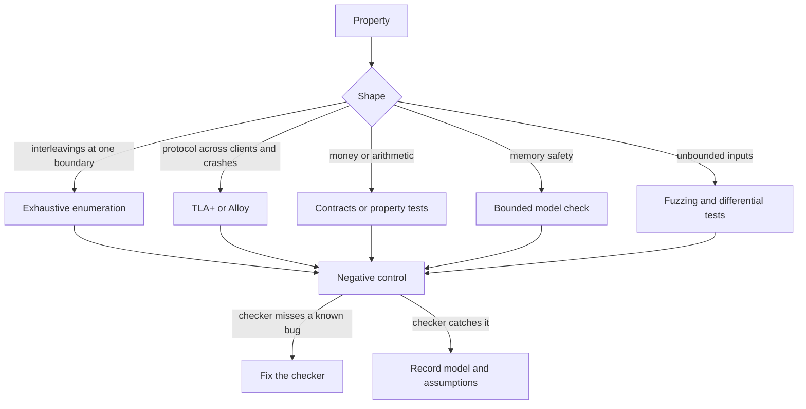
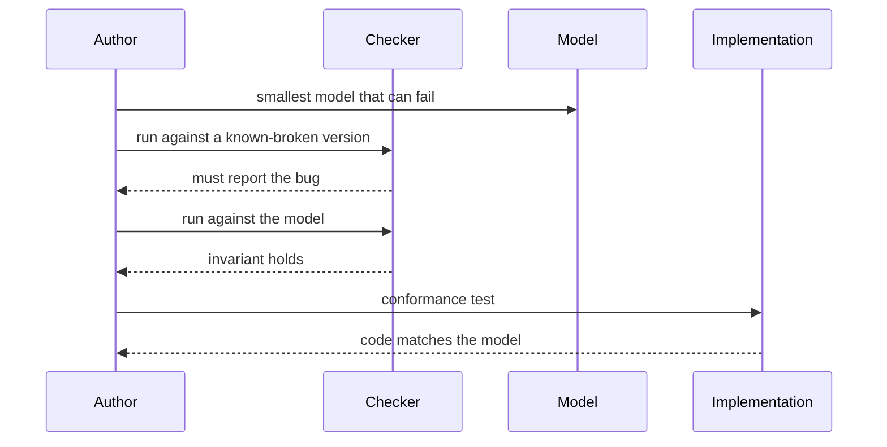

# formal-escalation

For properties a sample cannot settle.

```mermaid
flowchart TD
    P[Property] --> Q{Shape}
    Q -->|interleavings at one boundary| E[Exhaustive enumeration]
    Q -->|protocol across clients and crashes| M[TLA+ or Alloy]
    Q -->|money or arithmetic| C[Contracts or property tests]
    Q -->|memory safety| B[Bounded model check]
    Q -->|unbounded inputs| F[Fuzzing and differential tests]
    E --> N[Negative control]
    M --> N
    C --> N
    B --> N
    F --> N
    N -->|checker misses a known bug| X[Fix the checker]
    N -->|checker catches it| R[Record model and assumptions]
```

```mermaid
sequenceDiagram
    participant A as Author
    participant C as Checker
    participant M as Model
    participant I as Implementation

    A->>M: smallest model that can fail
    A->>C: run against a known-broken version
    C-->>A: must report the bug
    A->>C: run against the model
    C-->>A: invariant holds
    A->>I: conformance test
    I-->>A: code matches the model
```

## Rule

A model that cannot express a violation proves nothing.
